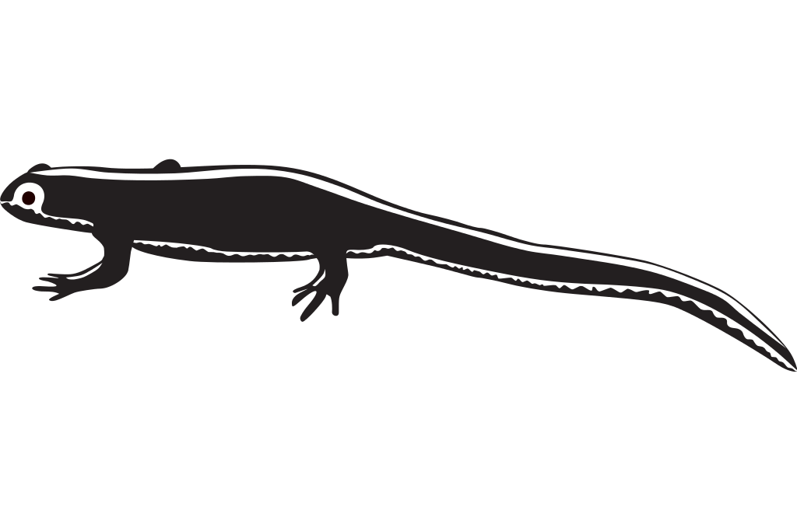

# ~ +*.; Project NEWT '.*+ ~

-------------------------

Main Board: ESP8266 Module

Radio: NRF24L01+PA+LNA Transceiver Module

Button: Any 2 pin button will work :)

LED: Any LED (I used a red one)

-------------------------

Disclaimer: This project is for educational purposes only. I am not responsible for any illegal applications you use it for :)
